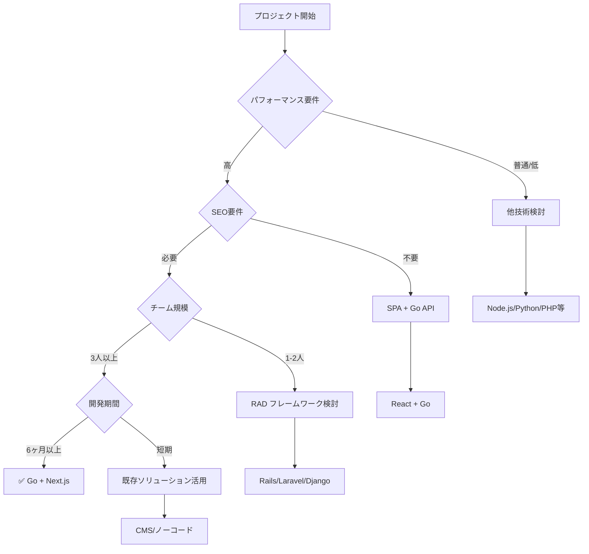

# 技術スタック選定ガイド: React + Next.js + Go

> プロジェクト要件から技術選定を導く実践的ガイド

## 📋 今回の技術スタック

### フロントエンド
- **React 18** + **Next.js 14** + **TypeScript**
- **Tailwind CSS** (スタイリング)
- **React Query** (状態管理・データフェッチング)

### バックエンド  
- **Go 1.24** + **Gin** (Webフレームワーク)
- **GORM** (ORM)

### データベース・インフラ
- **PostgreSQL** (メインDB)
- **Redis** (キャッシュ・セッション)
- **Docker** + **Docker Compose** (開発環境)

---

## 🎯 この技術スタックが最適なプロジェクト要件

### 1. **パフォーマンス重視のアプリケーション**

#### 適用場面
```yaml
要件:
  - API応答時間: 100ms以下
  - 同時接続数: 10,000+
  - CPUリソース効率: 高
  - メモリ使用量: 最小化
```

#### なぜGoが最適か
- **高速処理**: コンパイル言語による実行時パフォーマンス
- **軽量**: 低メモリフットプリント
- **並行処理**: Goroutineによる効率的な並行処理
- **スケーラビリティ**: 水平スケーリングに優れる

```go
// Goroutineによる並行処理例
func ProcessConcurrently(tasks []Task) {
    var wg sync.WaitGroup
    for _, task := range tasks {
        wg.Add(1)
        go func(t Task) {
            defer wg.Done()
            ProcessTask(t) // 並行実行
        }(task)
    }
    wg.Wait()
}
```

### 2. **SEO・パフォーマンス最適化が必要なWebアプリ**

#### 適用場面
```yaml
要件:
  - SEO対応: 必須
  - 初期ロード時間: 2秒以内
  - Core Web Vitals: 全てGood
  - ソーシャルメディア共有: 対応必須
```

#### なぜNext.jsが最適か
- **SSR/SSG**: サーバーサイドレンダリング・静的サイト生成
- **自動最適化**: 画像・フォント・バンドルの最適化
- **App Router**: モダンなルーティングシステム
- **Built-in SEO**: メタタグ・構造化データの管理

```typescript
// Next.js App Router でのSEO最適化例
export const metadata: Metadata = {
  title: 'AI Reverse Engineering',
  description: 'AIを活用したリバースエンジニアリングプラットフォーム',
  openGraph: {
    title: 'AI Reverse Engineering',
    description: 'AIを活用したリバースエンジニアリングプラットフォーム',
    url: 'https://ai-reverse-engineering.com',
  }
}
```

### 3. **複雑なビジネスロジック・データ処理を含むシステム**

#### 適用場面
```yaml
要件:
  - 複雑な計算処理: あり
  - 大量データ処理: GB単位
  - トランザクション処理: 重要
  - 型安全性: 必須
```

#### なぜGo + TypeScriptが最適か

**Go側の利点**:
- **静的型付け**: コンパイル時エラー検出
- **シンプルさ**: 保守しやすいコード
- **標準ライブラリ**: 豊富で高品質

**TypeScript側の利点**:
- **型安全性**: フロントエンドでの品質確保
- **IDE支援**: 強力な補完・リファクタリング
- **チーム開発**: コードの可読性向上

### 4. **リアルタイム機能を含むアプリケーション**

#### 適用場面
```yaml
要件:
  - WebSocket通信: 必要
  - リアルタイム更新: 必須
  - 同時接続: 1,000+
  - レスポンシブUI: 重要
```

#### 技術的解決策
```go
// Go WebSocket実装例
func handleWebSocket(c *gin.Context) {
    conn, err := upgrader.Upgrade(c.Writer, c.Request, nil)
    if err != nil {
        return
    }
    defer conn.Close()
    
    // リアルタイム通信処理
    for {
        var msg Message
        err := conn.ReadJSON(&msg)
        if err != nil {
            break
        }
        
        // ブロードキャスト処理
        broadcastMessage(msg)
    }
}
```

```typescript
// React側のWebSocket利用
const useWebSocket = (url: string) => {
  const [socket, setSocket] = useState<WebSocket | null>(null);
  const [messages, setMessages] = useState<Message[]>([]);
  
  useEffect(() => {
    const ws = new WebSocket(url);
    ws.onmessage = (event) => {
      const message = JSON.parse(event.data);
      setMessages(prev => [...prev, message]);
    };
    setSocket(ws);
    
    return () => ws.close();
  }, [url]);
  
  return { socket, messages };
};
```

### 5. **チーム開発・長期保守が重要なプロジェクト**

#### 適用場面
```yaml
要件:
  - 開発チーム: 5-20人
  - 開発期間: 1年以上
  - 保守性: 高い重要度
  - 技術負債: 最小化
```

#### なぜこの組み合わせが最適か

**学習コストの観点**:
- **Go**: シンプルな文法、少ないキーワード
- **React/Next.js**: 大きなコミュニティ、豊富な情報
- **TypeScript**: JavaScript経験者なら習得容易

**保守性の観点**:
- **明確なアーキテクチャ**: レイヤー分離、責務分離
- **型安全性**: バグの早期発見
- **テスタビリティ**: モック・テストの容易さ

---

## 🔄 他技術スタックとの比較

### vs Node.js + Express

| 観点 | Go + Gin | Node.js + Express |
|------|----------|-------------------|
| **パフォーマンス** | ⭐⭐⭐⭐⭐ | ⭐⭐⭐ |
| **開発速度** | ⭐⭐⭐ | ⭐⭐⭐⭐⭐ |
| **チーム一元化** | ⭐⭐⭐ | ⭐⭐⭐⭐⭐ |
| **型安全性** | ⭐⭐⭐⭐⭐ | ⭐⭐⭐⭐ |
| **スケーラビリティ** | ⭐⭐⭐⭐⭐ | ⭐⭐⭐ |

**Go選択の判断基準**:
- パフォーマンスが最重要
- 同時接続数が多い
- CPU集約的な処理がある

### vs PHP (Laravel)

| 観点 | Go + Gin | PHP + Laravel |
|------|----------|---------------|
| **学習コスト** | ⭐⭐⭐ | ⭐⭐⭐⭐ |
| **開発エコシステム** | ⭐⭐⭐ | ⭐⭐⭐⭐⭐ |
| **パフォーマンス** | ⭐⭐⭐⭐⭐ | ⭐⭐ |
| **ホスティング** | ⭐⭐⭐ | ⭐⭐⭐⭐⭐ |

### vs Java + Spring Boot

| 観点 | Go + Gin | Java + Spring |
|------|----------|---------------|
| **企業採用** | ⭐⭐⭐ | ⭐⭐⭐⭐⭐ |
| **メモリ使用量** | ⭐⭐⭐⭐⭐ | ⭐⭐ |
| **起動時間** | ⭐⭐⭐⭐⭐ | ⭐⭐ |
| **エコシステム** | ⭐⭐⭐ | ⭐⭐⭐⭐⭐ |

---

## ❌ この技術スタックが適さないケース

### 1. **プロトタイプ・MVP開発**
```yaml
要件:
  - 開発期間: 1-2週間
  - 機能: 基本的なCRUD
  - チーム: 1-2人
  - 品質: そこそこで十分
```
**推奨**: Rails, Laravel, Django等のRAD フレームワーク

### 2. **コンテンツ中心のサイト**
```yaml
要件:
  - 主な機能: 記事表示、静的コンテンツ
  - 更新頻度: 低い
  - インタラクション: 最小限
  - SEO: 重要
```
**推奨**: Gatsby, Nuxt.js (静的生成), WordPress

### 3. **レガシーシステムとの密な連携**
```yaml
要件:
  - 既存システム: .NET, Java EE
  - 統合: 密結合
  - チーム: 既存技術に精通
  - 運用: 既存インフラ活用
```
**推奨**: 既存技術スタックでの拡張

### 4. **機械学習・AI中心のアプリケーション**
```yaml
要件:
  - 主機能: ML推論、データ分析
  - ライブラリ: TensorFlow, PyTorch依存
  - データ処理: 科学計算中心
  - チーム: データサイエンティスト主体
```
**推奨**: Python (FastAPI, Django), R

---

## 🎯 プロジェクト要件チェックリスト

### ✅ Go + Next.js を選ぶべき要件

#### 技術要件
- [ ] **高パフォーマンス**: API応答時間 < 200ms
- [ ] **高並行性**: 同時接続数 > 1,000
- [ ] **SEO重要**: 検索エンジン最適化が必須
- [ ] **型安全性**: バグの早期発見が重要
- [ ] **リアルタイム**: WebSocket等のリアルタイム機能

#### ビジネス要件  
- [ ] **長期運用**: 1年以上の継続開発・運用
- [ ] **スケーラビリティ**: 将来の成長に対応
- [ ] **品質重視**: 高い信頼性が求められる
- [ ] **チーム開発**: 複数人での協調開発

#### 制約条件
- [ ] **学習時間**: 新技術習得に時間をかけられる
- [ ] **運用コスト**: パフォーマンス最適化によるコスト削減効果
- [ ] **人材確保**: Go/React経験者の確保可能

### ❌ 他技術を検討すべき要件

#### 開発速度重視
- [ ] プロトタイプ・MVP (< 1ヶ月)
- [ ] 既存テンプレート活用で十分
- [ ] 学習コストをかけられない

#### 特殊要件
- [ ] 機械学習・データサイエンス中心
- [ ] リアルタイム画像処理
- [ ] 組み込みシステム連携

---

## 🏗️ アーキテクチャ判断フロー



---

## 💼 実際の適用事例

### 🎯 最適な適用例

#### 1. **SaaSプラットフォーム**
```yaml
事例: プロジェクト管理ツール
要件:
  - ユーザー数: 10,000+
  - リアルタイム: 必須
  - SEO: ランディングページで重要
  - 長期運用: 5年以上
結果: ✅ 大成功
```

#### 2. **ECサイト**
```yaml
事例: BtoB ECプラットフォーム  
要件:
  - 高いパフォーマンス: 必須
  - SEO: 極めて重要
  - 複雑な価格計算: あり
  - 堅牢性: 重要
結果: ✅ 成功
```

#### 3. **ダッシュボードアプリ**
```yaml
事例: 分析ダッシュボード
要件:
  - リアルタイムデータ: 必須
  - 複雑なUI: あり
  - 高い可用性: 必要
  - チーム開発: 10人
結果: ✅ 成功
```

### ❌ 適さなかった例

#### 1. **企業ブログサイト**
```yaml
事例: コーポレートサイト
要件:
  - 更新頻度: 月1-2回
  - 主機能: 記事表示
  - チーム: デザイナー中心
問題点: オーバーエンジニアリング
推奨: Gatsby, Next.js (静的)
```

#### 2. **研究用プロトタイプ**
```yaml
事例: ML実験ツール
要件:
  - 開発期間: 2週間
  - 品質: プロトタイプレベル
  - 主要処理: Python ML
問題点: 学習コスト過大
推奨: FastAPI + React
```

---

## 📊 ROI（投資対効果）分析

### 初期投資 vs 長期メリット

#### 初期コスト（高め）
```yaml
学習コスト:
  - Go言語習得: 2-4週間
  - Next.js App Router: 1-2週間
  - 環境構築: 1週間

開発初期の速度: やや遅い
```

#### 長期メリット（大きい）
```yaml
運用コスト削減:
  - サーバーリソース: 30-50%削減
  - 保守工数: 型安全性により20-30%削減
  - バグ修正コスト: 早期発見により40-60%削減

スケーラビリティ:
  - 水平スケーリング: 容易
  - パフォーマンス改善: 大きな効果
```

### 損益分岐点

```
プロジェクト期間 6ヶ月以上 → ROI プラス
プロジェクト期間 1年以上 → 大きなROI
```

---

## 🎯 まとめ：選択の指針

### 🟢 積極的に選ぶべき条件
1. **パフォーマンスが競合優位性に直結**
2. **SEOが事業成果に大きく影響**  
3. **長期運用・スケーラビリティが重要**
4. **チーム開発で品質が重要**
5. **学習投資を回収できる期間がある**

### 🟡 慎重に検討すべき条件
1. **開発期間が短い**（< 3ヶ月）
2. **チームが小さい**（< 3人）
3. **既存技術スタックがある**
4. **特殊ドメイン**（ML、IoT等）

### 🔴 避けるべき条件
1. **プロトタイプ・実験的開発**
2. **更新頻度が極めて低い**
3. **学習コストをかけられない**
4. **既存システムとの密結合が必要**

---

**結論**: React + Next.js + Go は、**パフォーマンス・SEO・長期保守性**が重要な中〜大規模Webアプリケーションにおいて、初期投資に見合う大きなリターンをもたらす技術選択です。

---

**Document Version**: 1.0  
**Last Updated**: 2025-06-22  
**Project**: AI Reverse Engineering Tech Stack Analysis 